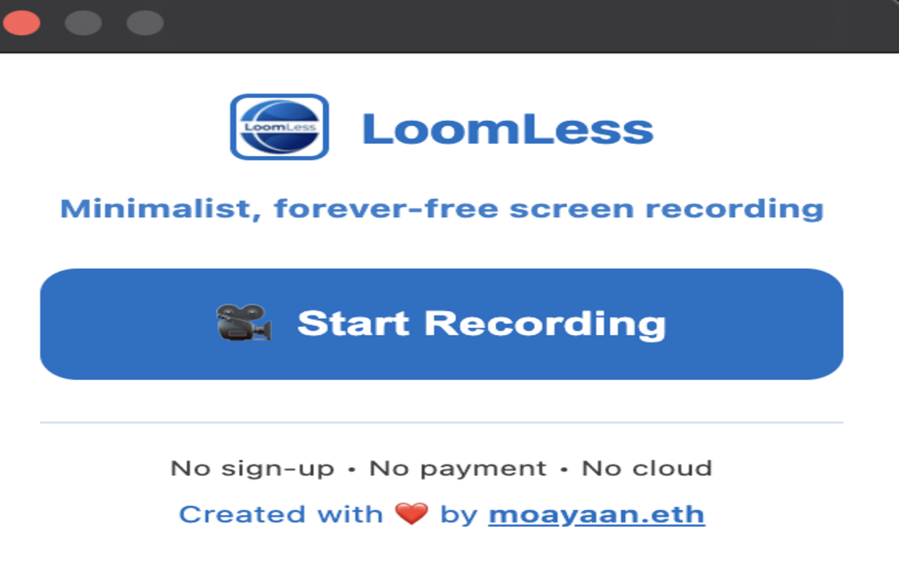
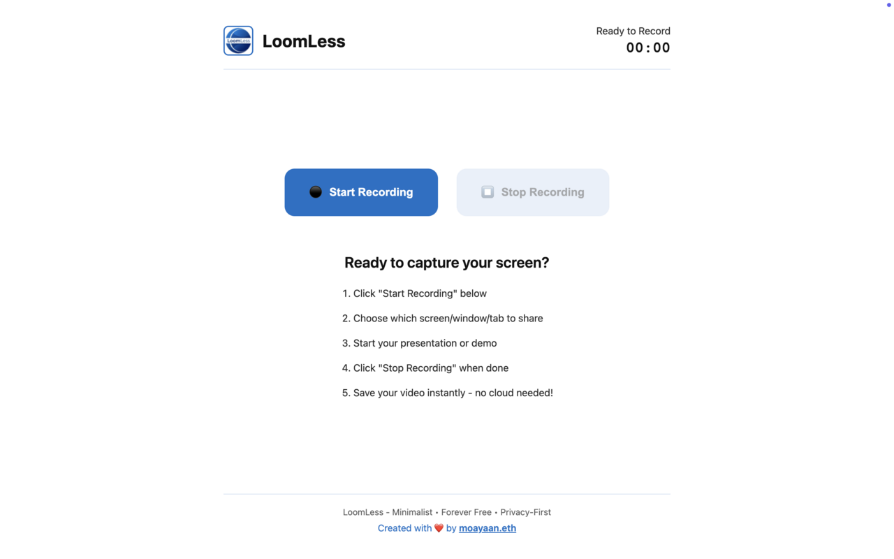
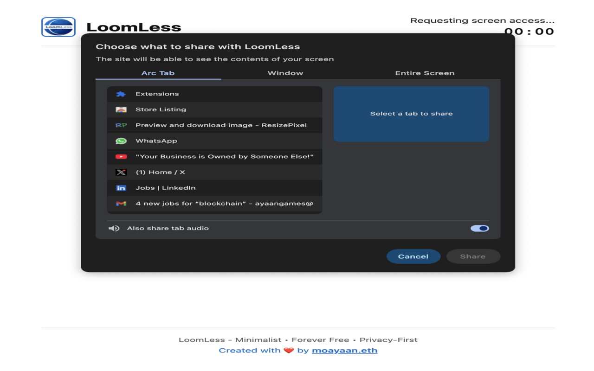
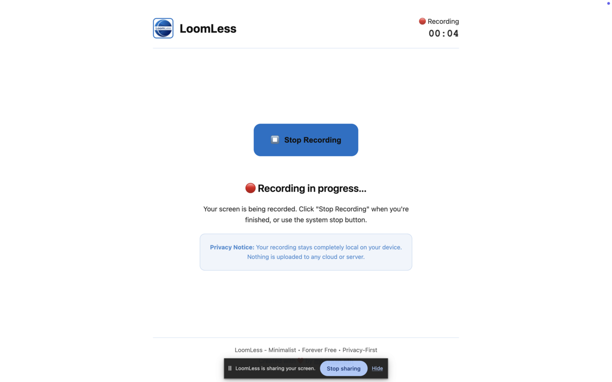

# 🎬 LoomLess

<div align="center">


**Minimalist, forever-free screen recording** 📹✨

_No sign-up • No payment • No cloud storage_

[](https://chromewebstore.google.com/detail/loomless/hpblkhdjmbiokmnemdmccpppjeoddecj)
[](https://coff.ee/moayaan.eth)

</div>

---

## 🚀 About LoomLess

LoomLess is a **privacy-first, minimalist screen recording extension** that puts simplicity and user control at the forefront. Record your screen instantly without the hassle of accounts, subscriptions, or cloud dependencies.

### 📸 Screenshots

<div align="center">
   
</div>

---

## ✨ Features

- 🎥 **Instant Screen Recording** - Start recording with one click
- 🔒 **Complete Privacy** - No data collection, no cloud uploads
- 💾 **Local Storage Only** - Your recordings stay on your device
- 🎛️ **Flexible Capture Options** - Record tabs, windows, or entire screen
- 🔊 **Audio Support** - Include system audio with your recordings
- ⚡ **Lightweight** - Minimal resource usage
- 🚫 **No Registration Required** - Use immediately without accounts
- 💰 **Forever Free** - No hidden costs or premium features
- 🛡️ **Privacy-First Design** - Your content never leaves your device
- 📱 **Simple Interface** - Clean, distraction-free UI

---

## 🛠️ Tech Stack

- **Frontend Framework:** Vanilla JavaScript
- **Styling:** Pure CSS3
- **Browser APIs:**
  - 🎬 MediaRecorder API
  - 🖥️ Screen Capture API
  - 💾 Downloads API
  - 🗂️ Chrome Storage API
- **Platform:** Chrome Extension (Manifest V3)
- **Icons & UI:** Custom designed interface
- **Development:** Claude Code (AI-assisted development)
- **Privacy:** Zero external dependencies

---

## 📥 Installation

### Option 1: Chrome Web Store

[**Download from Chrome Web Store**](https://chromewebstore.google.com/detail/loomless/hpblkhdjmbiokmnemdmccpppjeoddecj) 🚀

### Option 2: Manual Installation (Developer Mode)

1. **Download the Extension**

   ```bash
   git clone https://github.com/moayaan1911/loomless
   cd loomless
   ```

2. **Load in Chrome**

   - Open Chrome and navigate to `chrome://extensions/`
   - Enable "Developer mode" (top-right toggle)
   - Click "Load unpacked" and select the `extension` folder
   - 🎉 LoomLess will appear in your extensions!

3. **Pin the Extension**
   - Click the extensions icon (puzzle piece) in Chrome
   - Pin LoomLess for easy access

---

# 👨‍💻 About the Developer

<p align="center">
  
</p>

Assalamualaikum guys! 🙌 This is Mohammad Ayaan Siddiqui (♦moayaan.eth♦). I’m a **Full Stack Blockchain Developer** with over **2 years of experience** rocking the Web3 world! 🚀 I’ve worn many hats:

- Research Intern at a Hong Kong-based firm 🇭🇰
- Technical Co-Founder at a Netherlands-based firm 🇳🇱
- Full Stack Intern at a Singapore-based crypto hardware wallet firm 🇸🇬
- Currently a Blockchain Developer on a US-based Bitcoin DeFi project 🇺🇸
- Currently pursuing an online MBA in Blockchain Management from University of Studies Guglielmo Marconi, Italy 🇮🇹

Let’s connect and build something epic! Find me at [moayaan.com](https://moayaan.com) 🌐

If you liked this project, please donate to Gaza 🇵🇸 [UNRWA Donation Link](https://donate.unrwa.org/-landing-page/en_EN)

Happy coding, fam! 😎✨
