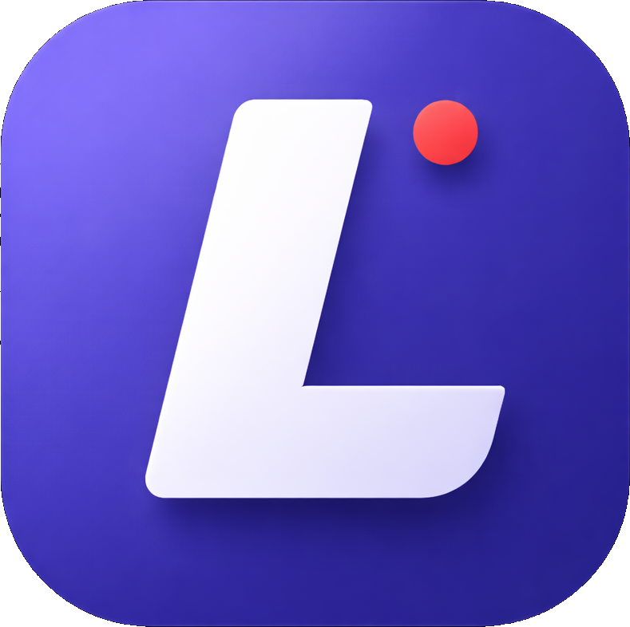
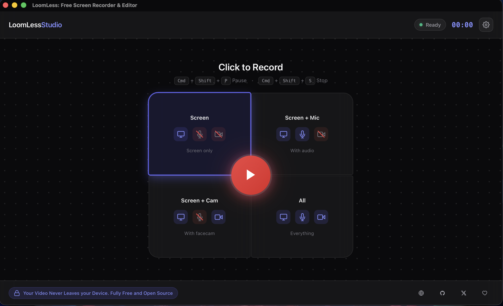
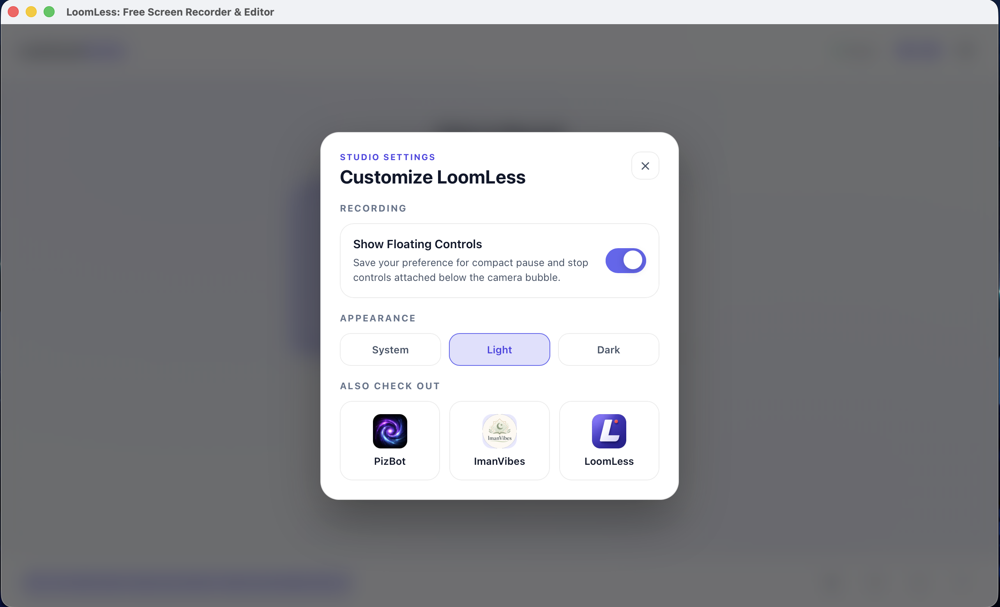
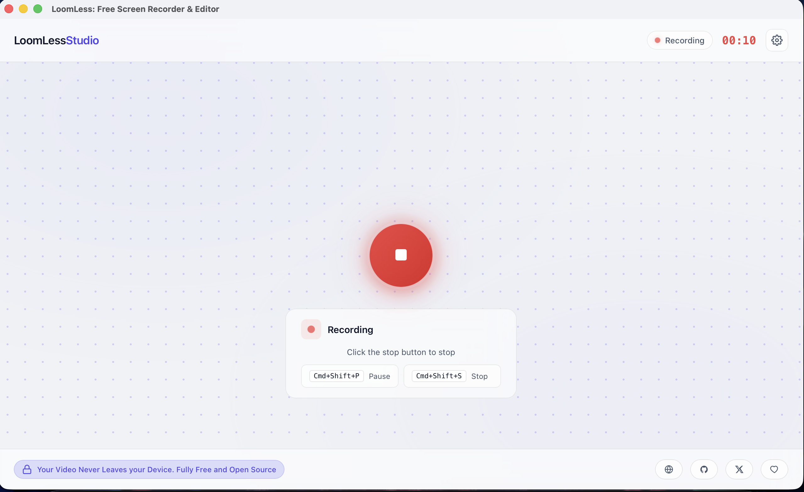
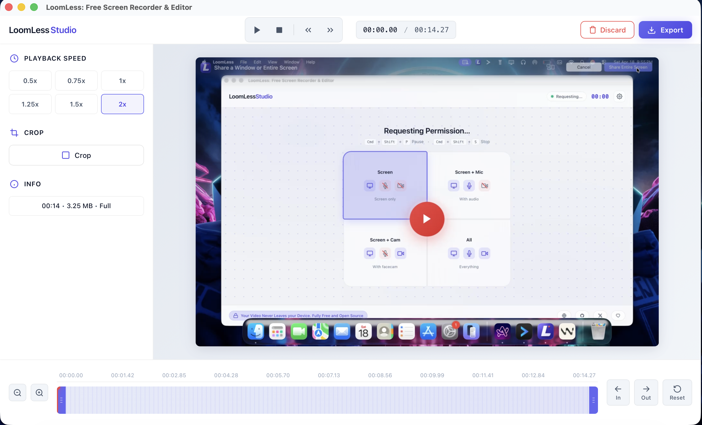

# 👨‍💻 About the Developer

<p align="center">
  
</p>

Assalamualaikum guys! 🙌 This is Mohammad Ayaan Siddiqui (♦moayaan.eth♦). I’m a **Full Stack Blockchain Developer** , **Crypto Investor** and **MBA in Blockchain Management** with **2 years of experience** rocking the Web3 world! 🚀 I’ve worn many hats:

- Research Intern at a Hong Kong-based firm 🇭🇰
- Founding Engineer at a Netherlands-based firm 🇳🇱
- Full Stack Intern at a Singapore-based crypto hardware wallet firm 🇸🇬
- Blockchain Developer at a US-based Bitcoin DeFi project 🇺🇸
- PG Diploma in Blockchain Management from Cambridge International Qualifications (CIQ) 🇬🇧
- MBA in Blockchain Management from University of Studies Guglielmo Marconi, Italy 🇮🇹

Let’s connect and build something epic! Find me at [moayaan.com](https://moayaan.com) 🌐 or on [X @moayaan1911](https://x.com/moayaan1911)

---

# 🎬 LoomLess

<div align="center">



### **Privacy-First Screen Recording Suite**

**YOUR VIDEO NEVER LEAVES YOUR DEVICE**

[](https://chromewebstore.google.com/detail/loomless/hpblkhdjmbiokmnemdmccpppjeoddecj)
[](https://loomless.fun)
[](LICENSE)
[](https://moayaan.com/donate)

<br/>

**🚫 No Sign-up** &nbsp;•&nbsp; **💳 No Payment** &nbsp;•&nbsp; **☁️ No Cloud** &nbsp;•&nbsp; **🕵️ No Tracking**

---

[📖 Description](#-description) &nbsp;•&nbsp; [✨ Features](#-features) &nbsp;•&nbsp; [📸 Screenshots](#-screenshots) &nbsp;•&nbsp; [🚀 Installation](#-installation) &nbsp;•&nbsp; [🎯 How to Use](#-how-to-use) &nbsp;•&nbsp; [🛠️ Tech Stack](#️-tech-stack) &nbsp;•&nbsp; [💜 Support](#-support-my-work)

---

</div>

## 📖 Description

<div align="center">

### 🎥 **Privacy-First Screen Recording Studio**

</div>

**LoomLess** is a privacy-first screen recording suite with a **macOS desktop app**, **Chrome extension**, and **landing page** built around one simple idea: **YOUR VIDEO NEVER LEAVES YOUR DEVICE**.

Whether you want a lightweight recorder, a clean editing flow, or a local-first alternative to cloud-heavy tools, LoomLess keeps the experience fast, simple, and fully under your control.

Visit **[loomless.fun](https://loomless.fun)** for updates and public release info.

### 🤔 Why LoomLess?

| ❌ Other Tools           | ✅ LoomLess                                   |
| ------------------------ | --------------------------------------------- |
| Require account creation | **Works instantly** - no sign-up              |
| Monthly subscriptions    | **Forever free** - no hidden costs            |
| Upload to cloud servers  | **100% local** - files stay on YOUR device    |
| Track your usage         | **Zero tracking** - we don't collect ANY data |
| Bloated with features    | **Clean & focused** - just what you need      |
| Watermarks on free tier  | **No watermarks** - ever                      |

### 💡 Perfect For

<table>
<tr>
<td align="center">👨‍💻<br/><b>Developers</b><br/>Bug reports & demos</td>
<td align="center">👨‍🏫<br/><b>Educators</b><br/>Tutorials & lessons</td>
<td align="center">👨‍💼<br/><b>Professionals</b><br/>Presentations & feedback</td>
<td align="center">🎮<br/><b>Creators</b><br/>Gameplay & content</td>
</tr>
</table>

### 🔒 Privacy Promise

```
┌─────────────────────────────────────────────────────────────┐
│  📍 Your recordings NEVER leave your device                 │
│  🚫 We collect ZERO data about you                          │
│  🔐 No accounts = No data to breach                         │
│  💾 Everything processed locally in your browser            │
│  🛡️  Open source = Full transparency                        │
└─────────────────────────────────────────────────────────────┘
```

---

## ✨ Features

<div align="center">

### 🎬 **Recording Capabilities**

</div>

| Feature                    | Description                                              |
| -------------------------- | -------------------------------------------------------- |
| 🖱️ **One-Click Recording** | Start recording instantly with a single click            |
| 🖥️ **Flexible Capture**    | Record entire screen, specific window, or browser tab    |
| 🎛️ **Floating Controls**   | Pause, resume, and stop from a draggable on-page control |
| 🔊 **Audio Support**       | Capture system audio along with video                    |
| 🎙️ **Microphone Support**  | Record your voice narration simultaneously               |
| ⏱️ **Unlimited Duration**  | Record as long as you need - no time limits              |
| 🎯 **High Quality**        | Crystal clear recordings at native resolution            |
| ⚡ **Lightweight**         | Minimal CPU/memory footprint                             |

<div align="center">

### 📷 **Webcam Overlay** _(New in v3.5!)_

</div>

| Feature                   | Description                                                 |
| ------------------------- | ----------------------------------------------------------- |
| 📷 **Camera Overlay**     | Show your webcam feed as a draggable circle over the screen |
| 🖱️ **Drag to Reposition** | Move the camera bubble anywhere on screen before recording  |
| 🎭 **Smart Compositing**  | Automatically handles all capture modes without duplication |
| 🔇 **Mic + Cam Combo**    | Record screen, webcam, and microphone all at once           |

<div align="center">

### 🎛️ **Floating Recording Control** _(New in v4.0.0!)_

</div>

| Feature                      | Description                                                       |
| ---------------------------- | ----------------------------------------------------------------- |
| ⏯️ **Pause / Resume Toggle** | Control your recording without returning to the dashboard         |
| ⏹️ **Quick Stop Control**    | Stop the recording instantly from the floating control            |
| 🌐 **Cross-Page Presence**   | Control follows across browser pages while you continue recording |
| 🖱️ **Drag to Reposition**    | Move the floating control anywhere that feels comfortable         |

<div align="center">

### 🎞️ **Built-in Video Editor**

</div>

| Feature                 | Description                                           |
| ----------------------- | ----------------------------------------------------- |
| ✂️ **Smart Trimming**   | Cut unwanted portions from start and end              |
| 🎯 **Free-Form Crop**   | Select any rectangular area to focus on               |
| ⚡ **Speed Control**    | Adjust playback speed from 0.5x to 2x                 |
| 📦 **Export Formats**   | Save as WebM or MP4                                   |
| 👁️ **Live Preview**     | See your edits in real-time before exporting          |
| 💾 **Local Processing** | All editing stays on-device with no cloud dependency  |

<div align="center">

### 🛡️ **Privacy & Security**

</div>

| Feature                    | Description                              |
| -------------------------- | ---------------------------------------- |
| 🚫 **No Account Required** | Use immediately - zero registration      |
| ☁️ **No Cloud Storage**    | Recordings saved directly to your device |
| 🕵️ **No Analytics**        | We don't track anything you do           |
| 🔓 **Open Source**         | Fully transparent codebase               |
| 💰 **No Premium Tier**     | All features free, forever               |

---

## 📸 Screenshots

### macOS Desktop App

| Home | Settings |
| ---- | -------- |
|  |  |

| Recording | Editor |
| --------- | ------ |
|  |  |

### Studio Extension

_Screenshots coming soon after the extension release is finalized._

---

## 🚀 Installation

### 📦 Option 1: Chrome Extension

<div align="center">

[](https://chromewebstore.google.com/detail/loomless/hpblkhdjmbiokmnemdmccpppjeoddecj)

</div>

Just click the button above and hit **"Add to Chrome"** - that's it! 🎉

Or visit **[loomless.fun](https://loomless.fun)** to learn more before installing.

### 🖥️ Option 2: macOS Desktop App

The desktop app lives in `desktop-app/` and is currently intended for local/dev builds while the release flow is being polished.

```bash
cd desktop-app
npm install
npm run tauri dev
```

For production builds:

```bash
cd desktop-app
bash sidecar/build.sh
npm run tauri build
```

### 🛠️ Option 3: Manual Extension Installation (For Developers)

<details>
<summary><b>Click to expand installation steps</b></summary>

<br/>

**Step 1:** Clone the repository

```bash
git clone https://github.com/moayaan1911/loomless.git
cd loomless
```

**Step 2:** Open Chrome Extensions

```
Navigate to: chrome://extensions/
```

**Step 3:** Enable Developer Mode

```
Toggle "Developer mode" switch (top-right corner)
```

**Step 4:** Load the Extension

```
Click "Load unpacked" → Select the "studio-extension" folder
```

**Step 5:** Pin for Easy Access

```
Click puzzle icon 🧩 → Pin LoomLess 📌
```

</details>

---

## 🎯 How to Use

<div align="center">

### 📹 **Recording Flow**

</div>

```
┌──────────────────────────────────────────────────────────────────┐
│                                                                  │
│   1️⃣  Click LoomLess icon in toolbar                             │
│                    ↓                                             │
│   2️⃣  Choose recording mode:                                     │
│       • 🖥️  Screen only                                          │
│       • 🎙️  Screen + Mic                                         │
│       • 📷  Screen + Camera                                       │
│       • 🎙️📷 Screen + Mic + Camera                               │
│                    ↓                                             │
│   3️⃣  (Optional) Drag camera bubble to desired position          │
│                    ↓                                             │
│   4️⃣  Click "Start Recording" & choose capture source:           │
│       • 🖥️  Entire Screen                                        │
│       • 🪟  Application Window                                    │
│       • 🌐  Browser Tab                                           │
│                    ↓                                             │
│   5️⃣  Record your content                                        │
│                    ↓                                             │
│   6️⃣  Click "Stop Recording" when done                           │
│                    ↓                                             │
│   7️⃣  Edit in built-in editor (optional)                         │
│       • ✂️  Trim start/end                                        │
│       • 🎯  Crop to focus area                                    │
│       • ⚡  Adjust playback speed                                 │
│                    ↓                                             │
│   8️⃣  Download your video! 🎉                                    │
│                                                                  │
└──────────────────────────────────────────────────────────────────┘
```

<div align="center">

### ⌨️ **Pro Tips**

</div>

| Tip                       | Description                                           |
| ------------------------- | ----------------------------------------------------- |
| 📌 **Pin the extension**  | Right-click extension icon → Pin for quick access     |
| 📷 **Position cam first** | Drag the camera bubble before hitting Start Recording |
| 🎯 **Use tab recording**  | For best quality when recording browser content       |
| ✂️ **Trim first**         | Remove mistakes before cropping                       |
| ⚡ **Speed up tutorials** | Use 1.5x or 2x for faster walkthroughs                |
| 📦 **Choose MP4**         | For better compatibility across devices               |

---

## 🛠️ Tech Stack

<div align="center">

| Technology                                                                                                              | Purpose                         |
| ----------------------------------------------------------------------------------------------------------------------- | ------------------------------- |
|  | Core recorder/editor logic      |
|                    | UI styling                      |
|                      | Desktop app shell               |
|                    | Tauri backend                   |
|                 | Native macOS camera overlay     |
|   | Extension platform              |
|                                | Screen and audio capture        |
|                                              | Overlay compositing and export  |
|                                  | Webcam and microphone access    |

</div>

### 📁 Project Structure

```
loomless/
├── 📂 assets/             # README images and shared media
├── 📂 desktop-app/        # Tauri macOS desktop app
│   ├── 📂 src/            # Recorder/editor frontend
│   ├── 📂 src-tauri/      # Rust backend and app bundle config
│   └── 📂 sidecar/        # Swift camera overlay binary
├── 📂 studio-extension/   # Chrome extension
│   ├── 📂 popup/          # Extension popup UI
│   ├── 📂 recorder/       # Recording and editing surface
│   ├── background.js      # Service worker
│   └── manifest.json      # Extension manifest
├── 📂 website/            # Landing page (loomless.fun)
├── 📄 README.md
└── 📄 LICENSE
```

---

## 🗺️ Roadmap

<div align="center">

| Status | Feature                           |
| ------ | --------------------------------- |
| ✅     | Screen, window, and tab recording |
| ✅     | Built-in video editor             |
| ✅     | Trim, crop, and speed adjustment  |
| ✅     | WebM and MP4 export               |
| ✅     | Webcam overlay support            |
| ✅     | Microphone recording              |
| ✅     | Floating controls                 |
| ✅     | Dark/Light/System theme           |
| ✅     | Camera overlay with drag position |
| ✅     | Screen + Mic/Cam modes           |
| ✅     | macOS desktop app                |
| ✅     | 100% local, privacy-first        |
| ✅     | No sign-up, forever free         |

</div>

---

## 🤝 Contributing

Contributions are welcome! Here's how you can help:

1. 🍴 **Fork** the repository
2. 🌿 **Create** a feature branch (`git checkout -b feature/amazing-feature`)
3. 💾 **Commit** your changes (`git commit -m 'Add amazing feature'`)
4. 📤 **Push** to the branch (`git push origin feature/amazing-feature`)
5. 🔃 **Open** a Pull Request

### 💡 Ideas for Contribution

- 🐛 Bug fixes
- ✨ New features
- 📝 Documentation improvements
- 🎨 UI/UX enhancements
- 🌍 Translations

---

## 💜 Support My Work

<div align="center">

If LoomLess has helped you, consider supporting its development!

[](https://moayaan.com/donate)

**Other ways to support:**

⭐ **Star this repo** - It helps others discover LoomLess

🐛 **Report bugs** - Help make LoomLess better

📢 **Spread the word** - Share [loomless.fun](https://loomless.fun) with friends and colleagues

💬 **Feedback** - Your suggestions shape the future of LoomLess

</div>

---

## 📄 License

<div align="center">

This project is licensed under the **MIT License**

```
MIT License - Feel free to use, modify, and distribute!
```

See [LICENSE](LICENSE) for details.

</div>

---

## 👨‍💻 Author

<div align="center">

**Built with 💜 by [♦moayaan.eth♦](https://moayaan.com)**

[](https://moayaan.com)
[](https://github.com/moayaan1911)
[](https://x.com/moayaan1911)

</div>

---

<div align="center">

### 🎬 **LoomLess** - Screen Recording, Simplified.

**Made with ❤️ for the privacy-conscious community**

🌐 [loomless.fun](https://loomless.fun)

</div>
